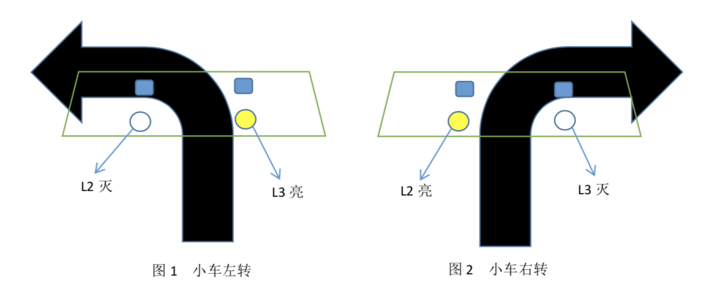

# AICar（3）

@2015202004  @2015202008  @2015202031  @2015202037

-------------------
## 黑线循迹部分&超声波避障

#### 扩展使用器材：
- 四个提示灯
- 两个光敏电阻

> 提示灯用于显示小车运行状况，光敏电阻用于调整小车对于轨道的识别灵敏度

#### 实验原理


> 当光电传感器P1下方为黑线时，LED指示灯L2灭，否则L2亮；同理，当光电传感器P2下方为黑线时，LED指示灯L3灭，否则L3亮。
- L2亮，L3亮，小车直行；
- L2灭，L3亮，小车左转（见下图1）
- L2亮，L3灭，小车右转（见下图2）
- L2灭，L3灭，小车停止。




> 当避障探头 P3 探测到障碍物距离小于 10cm 时，LED 指示灯 L1 亮，否则灭;同理，当 避障探头 P4 探测到障碍物距离小于 10cm 时，LED 指示灯 L4 亮，否则灭。

- L1 亮，L4 亮，小车停止
- L1 亮，L4 灭，小车停止
- L1 灭，L4 亮，小车停止
- L1 灭，L4 灭，小车前行


### 遇到的问题
> 小车光电传感器的光敏电阻大小有问题，导致其不够敏感，即有时传感器下方是黑线时，
传感器却无法准确判断其为黑线。

##### 解决方法:小心调节光敏电阻大小，直至符合实验要求

### 实验视频

1.S形轨道循迹

2.圆形轨道循迹

##### 解决方法:小心调节光敏电阻大小，直至符合实验要求

-------------------

------------------
### 线路重连
1.改变上阶段电池连接在马达上的方式，本阶段通过驱动板连接马达和面包板。
2.利用与Arduino之间的连接以程序控制小车的运行。 
3.蓝牙板通过连线与驱动板和Arduino板相连
4.达到手机能连接蓝牙，控制小车的运行。


------------------
### 上阶段问题解决
- [x] 左右轮转速不均衡
- 导入程序，调整车轮转速对应的代码，是两轮的速度一致达到直线行走的目的。
- [x] 接入外接电源之后，小车无法稳定行驶
- 重新分析连接线路，更换新电池，驱动力充足。
- [x] 蓝牙发送指令无效并接收到来自小车的乱码
- 修改蓝牙连接的线路，尝试更换其他端口，使得蓝牙能正确连接。
- [x] arduino板接入电源后，发出警报声
- 后来发现是马达的运作声音，单接Arduino板是没有声音的。重连线路后，arduino板能够正常运行。

------------------
### 本阶段实现的功能
- 能够使用手机操纵小车的前进、后退、左右转功能
- 能够自动行驶并且躲避障碍物，返回与障碍物之间的距离
- 能够搭载手机，实时传输小车所到达位置的路况

------------------
### 程序导入

```java
@luckh2
void setup() {
  // 启动程序
  Serial.begin(9600);    
  Rback_motor.setSpeed(0);
  Rback_motor.run(RELEASE);
  Lback_motor.setSpeed(0);
  Lback_motor.run(RELEASE);
  delay(2000);

  //超声波测距
  pinMode(echo, INPUT);
  pinMode(trig, OUTPUT);
}

```

```java
@luckh2
//以下为本实验中不同输入所对应的功能：其中输入'>'与'<'可以人为调整两个轮胎的转速，使得小车能够直线运行
void driver() {
  if ((getstr == '<')&&(RLRatio>0.1)) {
    RLRatio -= 0.1;
    Serial.println(RLRatio);
  }  
  if (getstr == '>') {
    RLRatio += 0.1;
    Serial.println(RLRatio);
  }  
  if (getstr == '5') {
    Serial.println("stopcar");
    stopcar();
    control=0;
  }
  if (getstr == '1') {
    Serial.println("forward");
    forward();
    control=0;
  }
if (getstr == '2') {
    Serial.println("backward");
    backward();
    control=0;
  }
  if (getstr == '3') {
    Serial.println("right");
    right();
    control=0;
  }
  if (getstr == '4') {
    Serial.println("left");
    left();
    control=0;
  }
  if (getstr=='6'){
    control=1;
    Serial.println("Auto Control On");
  }
  if(getstr=='7'){
    control=0;
    Serial.println("Auto Control Off");
  }
 
```
以上为本次实验的部分代码，针对我们组装小车时候遇见的问题给出了修正。


------------------
### 未来展望
- 预设想：“循迹小车”——为小车搭建跑道，利用传感器控制小车自动沿轨道运行。
- 结合图像识别相关技术，处理小车传送回来的影像。
- 提高小车的质量，减少小车运行出错。

